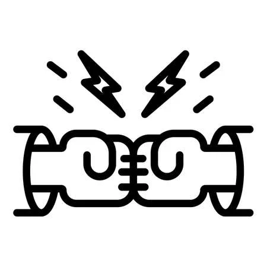

<div align="center">
<h1>ACDC</h1>
<h3>ACross Data Centers</h3>



**Learning distributed systems deployment across Availability Zones and Regions**

</div>

---

## About

This repository is a hands-on learning project for deploying and operating distributed systems across multiple data centers, availability zones, and regions.

Each folder contains configuration examples, deployment patterns, and research notes for different technologies.

> **Note**: Most applications don't require cross-region SLA. If AWS region goes down, you typically don't owe compensation. However, if you're a cloud vendor or dream of working for multinational corporations, this knowledge is valuable.

---

## Why Deploy Cross-Region?

| Reason | Description |
|--------|-------------|
| **Catastrophic Failure** | Prepare for floods, fires, network outages - disasters no one wants to think about, but they can happen |
| **Expected Failure** | NOC activities: switch failover, router replacement, rack migration - planned downtime with known impact |
| **Geo-Locality** | Benefits for edge caching, CDN, serving users closer to their location |

## Why NOT Deploy Cross-Region?

| Trade-off | Description |
|-----------|-------------|
| **Cost** | Maintenance fees + data transfer costs between data centers |
| **Latency & Throughput** | Can be high depending on the chosen architecture |
| **Complexity** | Historically difficult problem. Even major cloud providers rarely support cross-DC services out of the box |

### Key Challenges

When solving cross-DC problems, you'll face these hard issues:

| Challenge | Problem |
|-----------|---------|
| **Load Balancing** | Cross-switch/cross-DC load balancing is difficult. Global Server Load Balancing (GSLB) requires specialized solutions |
| **DNS Failover** | Asking users to point to multiple domains or clear DNS cache is poor UX. DNS TTL caching makes failover slow |
| **Data Consistency** | The hardest problem. Ensuring data consistency across DCs while maintaining performance is fundamentally difficult (see CAP theorem) |

```
User Request
     │
     ▼
┌─────────────────────────────────────────────────────────┐
│  DNS / Load Balancer  ← Hard: which DC to route to?     │
└─────────────────────────────────────────────────────────┘
     │                              │
     ▼                              ▼
┌──────────┐                  ┌──────────┐
│   DC1    │ ←── Sync? ────→  │   DC2    │  ← Hard: data consistency
└──────────┘                  └──────────┘
```

---

## Theoretical Foundation

### CAP Theorem

You can only support **two of the following three guarantees**:

| Property | Description |
|----------|-------------|
| **C** - Consistency | Every read receives the most recent write or an error |
| **A** - Availability | Every request receives a response (not guaranteed to be latest) |
| **P** - Partition Tolerance | System continues to operate despite network failures |

**Reality**: When running across DCs, partition tolerance **will** happen eventually.

| Environment | Bandwidth | Latency | Partition Risk |
|-------------|-----------|---------|----------------|
| Same DC | 10-100 Gbps, bonded | <1ms | Very rare (redundant switches) |
| Cross DC | ~1 Gbps | 50-150ms | Expected |

Once you sacrifice for **P**, both **C** and **A** will be affected.

---

## Replication Techniques Comparison

| Technique | Consistency | Availability | Partition Tolerance |
|-----------|-------------|--------------|---------------------|
| **Backup** | Weak (snapshot gap) | Excellent | Data loss = time since last backup |
| **Master-Slave** | Eventual | Good (slave serves read) | Some data loss possible |
| **Multi-Master** | Eventual (complex merge) | Excellent | Transaction guarantee only within DC |
| **2PC/Paxos/Raft** | Strong | Lower (sync overhead) | No data loss |

### Backup
```
DC1 [Primary] ----snapshot----> DC2 [Backup]
                 (daily/hourly)
```
- **Pros**: Simple, no impact on primary performance
- **Cons**: Large data gap, restore requires compute time → downtime

### Master-Slave (Async Replication)
```
DC1 [Master] ====async====> DC2 [Slave]
    (R/W)                     (Read only)
```
- **Pros**: Slave can serve reads, transaction log preservable
- **Cons**: Eventually consistent - writes take time to appear on slave
- **Examples**: AWS S3, most RDBMS

### Multi-Master
```
DC1 [Master] <===async===> DC2 [Master]
    (R/W)                     (R/W)
```
- **Pros**: Both can serve read/write
- **Cons**: Complex merge conflicts, no global clock, transaction only guaranteed within same DC

### 2PC / Paxos / Raft
```
1. Propose  →  All nodes
2. Vote     ←  Majority agrees
3. Commit   →  All nodes (or abort)
```
- **Pros**: Complete distributed consensus, no data loss, full transaction support
- **Cons**: Heavyweight, synchronous, high latency, complex to understand
- **Examples**: etcd, ZooKeeper, CockroachDB

---

## Technologies

| Category | Managed | Self-hosted | Status |
|----------|---------|-------------|--------|
| [Kafka](./kafka/) | Confluent | Strimzi | Active |
| [Distributed SQL](./distributed-sql/) | Aurora Global | TiDB | Docs |
| [NoSQL](./nosql/) | DynamoDB Global | Cassandra | Docs |
| [Object Storage](./object-storage/) | AWS S3 | MinIO | Docs |
| [DNS](./dns/) | Route 53 | PowerDNS | Docs |
| [Service Discovery](./service-discovery/) | HCP Consul | Consul OSS | Docs |
| [API Gateway](./api-gateway/) | AWS API Gateway | Kong | Docs |

---

## Common Patterns

### Infrastructure Terminology

```
┌────────────────────────────────────────────────────────────────────────────┐
│                              REGION (us-east-1)                            │
│                                                                            │
│   ┌─────────────────────────┐         ┌─────────────────────────┐          │
│   │    AZ (us-east-1a)      │         │    AZ (us-east-1b)      │          │
│   │                         │         │                         │          │
│   │  ┌───────────────────┐  │         │  ┌───────────────────┐  │          │
│   │  │   DATACENTER      │  │         │  │   DATACENTER      │  │          │
│   │  │                   │  │         │  │                   │  │          │
│   │  │  ┌─────┐ ┌─────┐  │  │         │  │  ┌─────┐ ┌─────┐  │  │          │
│   │  │  │RACK1│ │RACK2│  │  │         │  │  │RACK1│ │RACK2│  │  │          │
│   │  │  └─────┘ └─────┘  │  │         │  │  └─────┘ └─────┘  │  │          │
│   │  └───────────────────┘  │         │  └───────────────────┘  │          │
│   └─────────────────────────┘         └─────────────────────────┘          │
└────────────────────────────────────────────────────────────────────────────┘
```

| Term | Scope | Failure Domain | Latency | Example |
|------|-------|----------------|---------|---------|
| **Rack** | Physical server cabinet | Power, ToR switch | <0.5ms | Single cabinet with 20-40 servers |
| **Datacenter (DC)** | Building/facility | Power grid, cooling, network | <1ms | A building with multiple racks |
| **Availability Zone (AZ)** | Isolated infrastructure | Independent power, network, cooling | 1-2ms | AWS us-east-1a, us-east-1b |
| **Region** | Geographic area | Natural disasters, large-scale outages | 50-150ms | AWS us-east-1 (N. Virginia), eu-west-1 (Ireland) |

**Key Points**:
- **Rack** → Spread replicas to survive single rack failure (switch, power)
- **AZ** → Spread across AZs to survive datacenter failure (cloud best practice)
- **Region** → Spread across regions to survive regional disasters (highest availability, highest complexity)

> **Cloud vs On-premise**:
> - AWS/GCP/Azure: One AZ can contain **multiple datacenters** (different buildings/floors) connected by low-latency links, but they're treated as a single failure domain from user's perspective
> - On-premise: You define your own failure domains based on your infrastructure

### Deployment Strategies

| Pattern | Description | RPO | RTO |
|---------|-------------|-----|-----|
| **Stretch Cluster** | Single cluster across 3 DCs, sync replication | 0 | ~0 |
| **Active/Passive** | Primary + standby, async replication | >0 | >0 |
| **Active/Active** | Both DCs serve traffic, bidirectional sync | >0 | ~0 |

### RTO - Recovery Time Objective

> *"How much time did it take to recover after notification of business process disruption?"*

**RTO** is the maximum acceptable delay between the interruption of service and restoration of service. This determines what is considered an acceptable time window when service is unavailable.

```
Disaster ──────────────────────────────> Service Restored
          |<─────────── RTO ───────────>|
                   (downtime)
```

### RPO - Recovery Point Objective

> *"Up to what point in time could the business process recovery proceed tolerably given the volume of data lost?"*

**RPO** is the maximum acceptable amount of time since the last data recovery point. This determines acceptable data loss between the last recovery point and the interruption.

```
Last Backup ────────────────────────────> Disaster
            |<─────────── RPO ──────────>|
                    (data loss)
```

**Example**: If a failure occurs now and your last backup was 24 hours ago, your RPO is 24 hours.

### RTO vs RPO Relationship

```
        RPO                          RTO
         │                            │
         ▼                            ▼
─────────●────────────────────────────●─────────────────>
    Last Backup               Disaster            Recovery
                                  │                   │
                                  |<── Downtime ─────>|
```

| Metric | Measures | Question |
|--------|----------|----------|
| **RPO** | Data loss tolerance | How much data can we afford to lose? |
| **RTO** | Downtime tolerance | How long can we be offline? |

**Trade-off**: The more stringent (lower) your RTO and RPO requirements, the more expensive the solution:
- Lower RPO → More frequent backups → More storage & network costs
- Lower RTO → Faster failover → More redundancy & automation costs

### Other Key Concepts

- **Rack Awareness**: Spread replicas across failure domains
- **Anti-Affinity**: Don't place replicas on same node/rack/zone (avoid single point of failure)
- **Quorum**: Majority of nodes must agree (e.g., 3 nodes → need 2 to agree)
- **Split-Brain**: Two partitions think they're the leader → data inconsistency
- **Fencing**: Prevent split-brain by killing/isolating old leader

---

## Getting Started

```bash
# Clone the repository
git clone <your-repo-url>

# Explore Kafka multi-DC patterns
cd kafka/

# Each technology has its own README with detailed instructions
```

---

## License

This project is for research and educational purposes.
